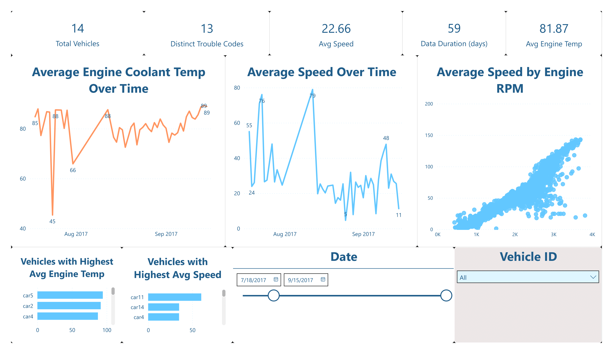

# Vehicle Diagnostic Data Pipeline

## Objective
This project demonstrates a complete ETL (Extract, Transform, Load) pipeline for processing vehicle sensor data from multiple vehicles over time. The goal is to clean raw sensor logs, load them into a SQLite database, and prepare the data for analysis and visualization. This project showcases foundational data engineering skills for the automotive industry.

## 📊 Dataset Overview
- **Size**: 60,441+ sensor readings
- **Vehicles**: Multiple Chevrolet vehicles tracked
- **Features**: 32 sensor parameters including engine metrics, fuel data, and diagnostic codes
- **Time Period**: Continuous monitoring with timestamp data
- **Format**: CSV with comprehensive vehicle diagnostic information

## Tech Stack
- **Data Transformation:** Python (Pandas, NumPy, Matplotlib)
- **Database:** SQLite
- **BI & Visualization:** Power BI
- **Development Environment:** Jupyter Notebook

## Project Structure

```
volvo_diag_project/
├── data/                    # Data storage
│   ├── raw/
│   │   └── sensor_data.csv  # Original 60K+ sensor readings
│   └── processed/
│       └── cleaned_sensor_data.csv  # Cleaned dataset
├── database/                # SQLite database
│   └── vehicle_diagnostics.db      # Production database
├── notebooks/               # Data analysis
│   └── 01_data_cleaning.ipynb      # EDA & cleaning workflow
├── scripts/                 # ETL automation
│   └── load_to_db.py               # Database loading script
├── dashboards/              # Visualization exports (empty)
├── volvo_proj.pdf          # Dashboard export
├── volvo_proj.png          # Dashboard preview
├── PROJECT_REPORT.md       # Comprehensive analysis report
├── requirements.txt        # Python dependencies
└── README.md              # This file
```

## ETL Pipeline Overview

### 1. Extract 📥
- **Source**: `data/raw/sensor_data.csv` (60,441+ records)
- **Format**: CSV with 32 columns of vehicle diagnostic data
- **Content**: Real-time sensor readings from multiple Chevrolet vehicles
- **Key Fields**: TIMESTAMP, VEHICLE_ID, ENGINE_RPM, SPEED, FUEL_LEVEL, ENGINE_TEMP, etc.

### 2. Transform 🔄
- **Notebook**: `notebooks/01_data_cleaning.ipynb`
- **Data Quality**: Handle missing values using statistical imputation
- **Outlier Detection**: Visualize anomalies using boxplots
- **Data Types**: Convert and validate column formats
- **Output**: Clean dataset saved to `data/processed/cleaned_sensor_data.csv`

### 3. Load 📤
- **Script**: `scripts/load_to_db.py`
- **Target**: SQLite database (`database/vehicle_diagnostics.db`)
- **Table**: `sensor_readings` with optimized schema
- **Result**: Production-ready database for analysis

## 📊 Live Dashboard


*Interactive Power BI dashboard showing vehicle performance metrics, trends, and diagnostic insights.*

## 📝 Detailed Project Report
For comprehensive analysis including key insights, business recommendations, and technical findings, see the full **[PROJECT_REPORT.md](PROJECT_REPORT.md)**.

## Key Features & Findings
- **Real-time Monitoring**: Track 32+ sensor parameters across multiple vehicles
- **Predictive Maintenance**: Identify patterns in engine performance and fuel efficiency  
- **Diagnostic Insights**: Analyze trouble codes and maintenance requirements
- **Performance Optimization**: Monitor RPM, speed, and temperature correlations


## 🚀 How to Run This Project

### Prerequisites
- Python 3.8+ installed
- Git for cloning the repository
- Power BI Desktop (optional, for dashboard viewing)

### Setup Instructions

1. **Clone the repository**
   ```bash
   git clone <repository-url>
   cd volvo_diag_project
   ```

2. **Set up Python environment**
   ```bash
   # Create virtual environment
   python -m venv venv
   
   # Activate environment
   # Windows:
   venv\Scripts\activate
   # macOS/Linux:
   source venv/bin/activate
   ```

3. **Install dependencies**
   ```bash
   pip install -r requirements.txt
   ```

4. **Verify data structure**
   - Raw data is already included: `data/raw/sensor_data.csv` ✅
   - Processed data available: `data/processed/cleaned_sensor_data.csv` ✅
   - Database ready: `database/vehicle_diagnostics.db` ✅

5. **Run the analysis**
   ```bash
   # Option 1: Run Jupyter notebook for interactive analysis
   jupyter notebook notebooks/01_data_cleaning.ipynb
   
   # Option 2: Execute ETL script directly
   python scripts/load_to_db.py
   ```

6. **View results**
   - Open `PROJECT_REPORT.md` for detailed analysis
   - View `volvo_proj.png` for dashboard preview
   - Connect Power BI to `database/vehicle_diagnostics.db` for interactive exploration

### 🎯 Quick Start
Everything is pre-configured! The dataset, cleaned data, and database are already included. Simply install dependencies and explore the analysis.
